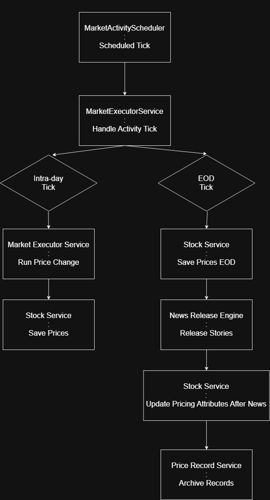

## :books: Table of Contents

<ol>
    <li><a href="#design-overview">Market Service Overview</a></li>
    <li><a href="#folder-structure">Folder Structure Guide</a></li>
    <li><a href="#module-architecture">Module Architecture</a></li>
    <li><a href="#data-flow">Data Flow Architecture</a></li>
    <li><a href="#stock-pricing-design">Stock Pricing Design</a></li>
</ol>    

<br/> 
<!-- -------------------------------------------------------------------------------------------------------------------------------------------- -->

<h2> 📂 Folder Structure Guide <a id="folder-structure"></a></h2>

```md
.
└── stock-market-service/src/org/api/stockmarket/
    ├── core/ -> holds interfaces, base classes, and other core features
    ├── engine/ -> the core of the app, including @Scheduled class to handle tick rate and market advancement
    └── modules/
        ├── indexfunds/
        ├── news/
        ├── simulatedmarket/ -> all in-memory market simulation interfaces
        └── stocks/
```

<br/> 
<!-- -------------------------------------------------------------------------------------------------------------------------------------------- -->


<h2> Data Flow Architecture <a id="data-flow"></a></h2>

### High-Level Market Tick Flow




<br/> 
<!-- -------------------------------------------------------------------------------------------------------------------------------------------- -->

